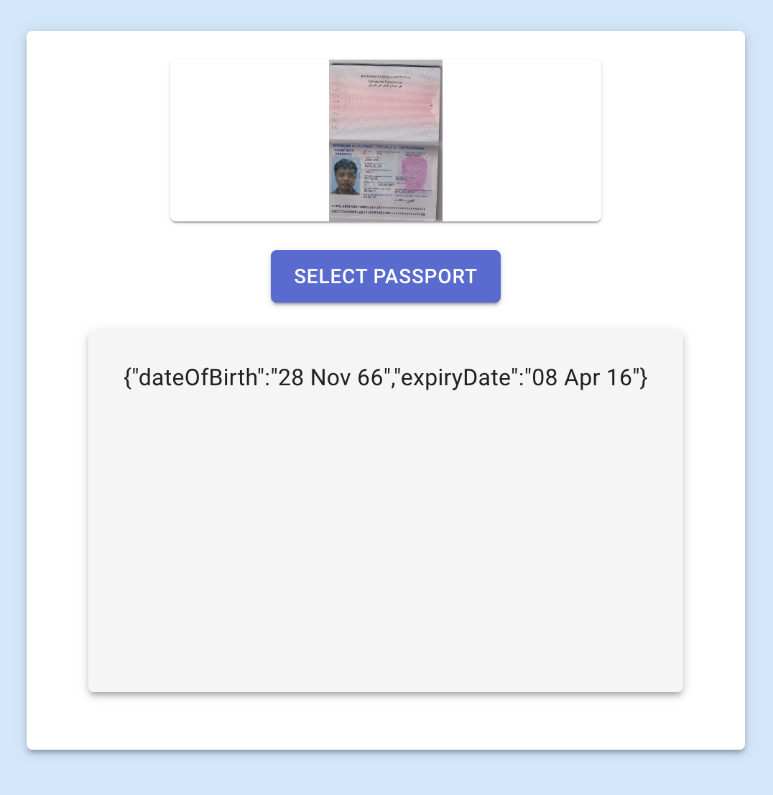

# Borderless Passport App

## Overview
1) Build a node API that takes a passport image and returns the date of birth & expiry date. 

2) Build a front-end web app where users can upload images of their passports, and by calling the API you built in part 1, return the date of birth & expiry date to the user.

## Technologies Used
- Nodejs 
- Express
- PostgreSQL
- Jest
- Docker
- Typescript
- React
- Styled-components
- Material-UI
- Redux-toolkit

## Setup Instructions
1. Install latest node and npm.
2. Run the APIs: Change to root of the project and run `docker-compose up`

## Testing 
To run tests on backend, use the following command:

- ```npm i```
- ```npm test```

To clean the build of the backend (dist/) on run:

-  ```npm run clean```

To run the backend locally, run the following commands:

- ```npm i```
- ```npm run start_local```

To run the frontend locally, run the following commands:

- ```npm i```
- ```npm start```

## Examples 

### Request

## GET /health_check/

    curl -i -H 'Accept: application/json'  localhost:3000/healthcheck

### Response

    ```{
    "success": true,
    "status": 200,
    "data": {
        "name": "borderless-takehome-backend",
        "version": "1.0.0"
    }
}```


## GET /passport/get-signed-url?ileName={file-name}&contentType={content-type}

    curl -i -H 'Accept: application/json' http://localhost:3000/passport/generate-signed-url?fileName=test.jpeg&contentType=image/jpeg

### Response

    ```{
    "success": true,
    "status": 200,
    "data": {
        "url": ""
    }
}
```

## POST passport/extract-dates

    curl --location --request GET 'http://localhost:3000/passport/extract-dates' --header 'Content-Type: application/json' --data '{"imagePath": "bucket-name"}'

### Response

    ```{
    "success": true,
    "status": 200,
    "data": {
        "dateOfBirth": "28 Nov 66",
        "expiryDate": "08 Apr 16"
    }
}
```

